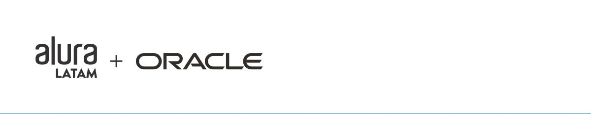

# Barbearia Alura

# Sobre

     Projeto/exercicio proposto pela Alura para pratica Html e CSS.

 
    Nesse projeto fiz ao estilo vintage, melhorando o design final, tentando sempre incluir o que tem a ver com o tema, com animação poste fixado que linka ao topo onde fica o menu de navegação. projeto ficou super interativo, fácil e didático para o usuário utilizar.

# Caracteristicas

- [x] Elemententos HTML semântico.
- [x] CSS BEM Estilo vintage, barbearia. Responsivo Desktop, Tablet e Smartphone.  
- [x] botão que copiar resultado para área de transferência.
- [x] animação.

# Autor
Made for Lucas Martins </> [see my linkedIn](https://www.linkedin.com/in/lucas-martins-desenvolvedor/)
